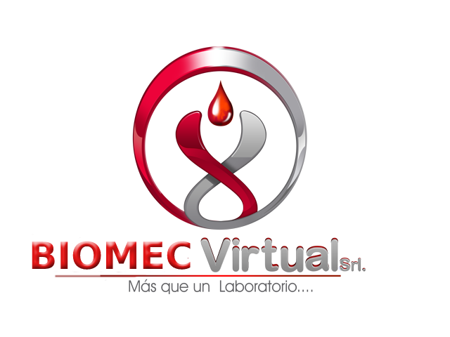

# Laboratorio clinico Biomec
Proyecto  de la materia Sistema de Información 1, con la Ing. Angelica 
# Login (Autenticación) con Python, Flask y PosgresSQL

Autenticación de usuarios utilizando Python, Flask, flask-login y PosgresSQL.

1.- Crear un entorno virtual:
Descargar el proyecto, ingresa a la ruta del proyecto desde el cmd, (esto solo se realiza la primera vez) ejecutar lo siguiente:
### `python -m virtualenv env`

2.- Activar el entorno virtual, en el mismo cmd, ejecutar:
### `.\env\Scripts\activate.bat`

3.- Para instalar los paquetes necesarios, esto solo se realiza la primera vez que abres el proyecto desde otro equipo:
### `pip install -r requirements.txt`

4.- Ingresar a Visual Code, desde el mismo cmd, ejecutar:
### `code .`

  

## <a name='reference'>Referencias</a>

- **Referencia 1:**
	+ [Estructura de proyecto MVC](https://www.youtube.com/watch?v=TTYdcZ4aYz8)
	+ [login Flask				 ](https://youtu.be/FX0lMm_Qj10)
	+ [Conección con psycopg2](https://youtu.be/5eziBv2OWNI)
	+ [Conección con posgrestsql y Heroku](https://youtu.be/MLow0gI6oNY) 
